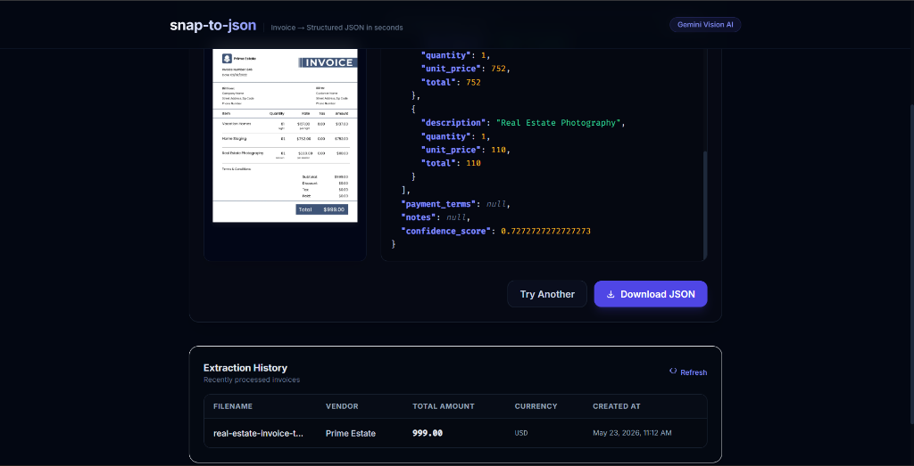
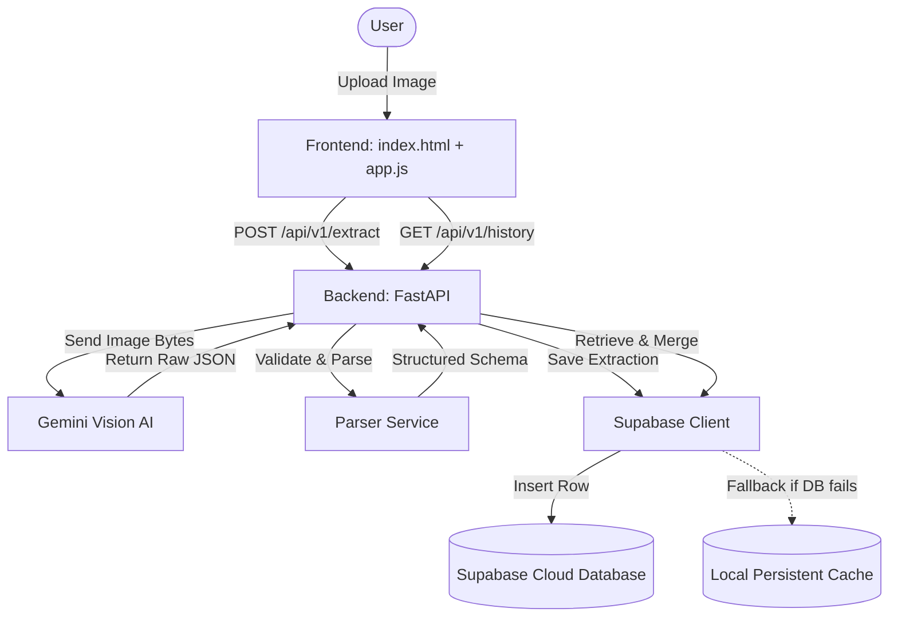
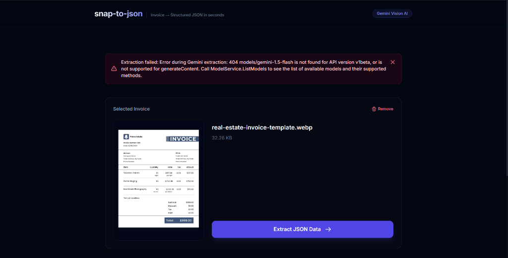
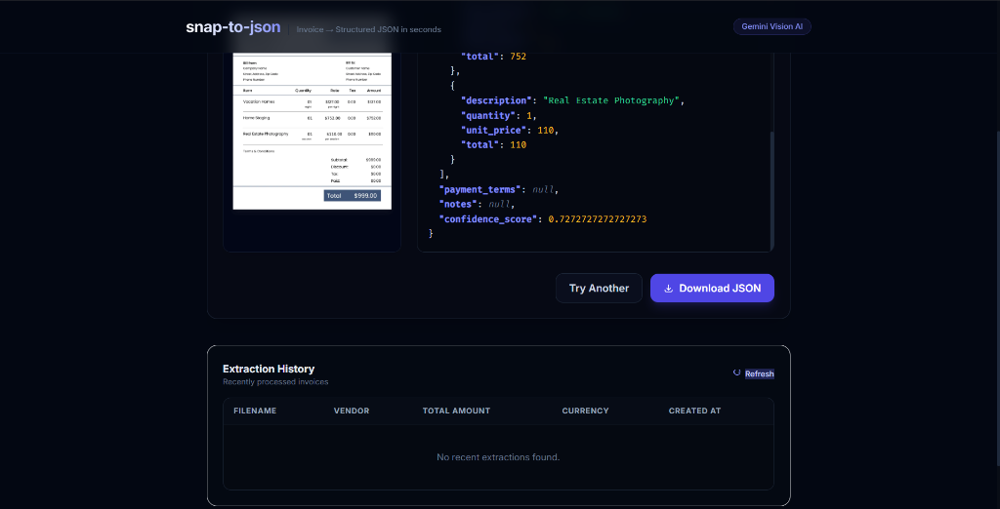

# ⚡ Snap to JSON — AI Invoice Extractor

<p align="center">
  
</p>

<p align="center">
  
  
  
  
  
</p>

---

**Snap to JSON** is a modern, high-performance web application designed to extract structured JSON data from invoice images in seconds. Utilizing the power of **Google Gemini Vision API** for intelligent layout understanding and **Supabase** for secure cloud storage, it provides a seamless, developer-friendly pipeline for document digitization.

## ✨ Features

- 🤖 **Gemini-Powered Extraction:** Automatically parses invoice images (PNG, JPEG, WEBP) to extract vendors, line items, tax, totals, due dates, and payment terms using structured Pydantic schemas.
- ⚡ **Vibrant Dark UI:** A premium, responsive interface featuring elegant glassmorphism, interactive drag-and-drop file zones, and real-time processing statistics.
- 🔬 **Confidence Score & Stats:** Real-time visibility into parsing confidence scores and extraction latency (in milliseconds).
- 📥 **Interactive JSON Viewer & Download:** Beautifully colored syntax highlighting for extracted JSON output, with one-click download and clipboard copying.
- 🛡️ **Robust Persistence Fallback:** Automatically falls back to a local persistent JSON cache (stored in the system's temporary directory to avoid server reload loops) if Supabase is unreachable or missing schema configurations.
- 📂 **Historical Extraction Drawer:** Inspect previous extractions in a history log table with full interactive modal review and retrieval.

---

## 🏗️ Architecture



---

## 📸 Screenshots

| Upload Zone | Data Output Side-by-Side |
| :---: | :---: |
|  |  |

---

## 🚀 Getting Started

### Prerequisites

- **Python 3.10+** installed.
- A **Google Gemini API Key** (obtainable from [Google AI Studio](https://aistudio.google.com/)).
- A **Supabase Project** (sign up at [supabase.com](https://supabase.com)).

### Installation

1. **Clone the repository:**
   ```bash
   git clone https://github.com/your-username/snap-to-json.git
   cd snap-to-json
   ```

2. **Create and activate a virtual environment:**
   ```bash
   python -m venv venv
   # On Windows
   .\venv\Scripts\activate
   # On macOS/Linux
   source venv/bin/activate
   ```

3. **Install the dependencies:**
   ```bash
   pip install -r requirements.txt
   ```

4. **Configure environment variables:**
   Create a `.env` file in the root directory:
   ```env
   GEMINI_API_KEY=your_gemini_api_key
   SUPABASE_URL=https://your-project-ref.supabase.co
   SUPABASE_ANON_KEY=your_supabase_anon_key
   APP_ENV=development
   MAX_FILE_SIZE_MB=10
   ```

### 🗄️ Database Setup (Supabase)

To enable cloud storage and history retrieval, run this SQL script in your **Supabase SQL Editor** to create the `extractions` table and disable/configure RLS:

```sql
-- 1. Create the extractions table if you haven't already
CREATE TABLE IF NOT EXISTS extractions (
    id UUID PRIMARY KEY,
    filename TEXT NOT NULL,
    vendor TEXT,
    invoice_number TEXT,
    invoice_date TEXT,
    due_date TEXT,
    total_amount NUMERIC,
    subtotal NUMERIC,
    tax_amount NUMERIC,
    currency TEXT DEFAULT 'USD',
    line_items JSONB DEFAULT '[]'::jsonb,
    payment_terms TEXT,
    notes TEXT,
    confidence_score NUMERIC,
    raw_json JSONB DEFAULT '{}'::jsonb,
    created_at TIMESTAMPTZ DEFAULT NOW()
);

-- 2. Disable Row Level Security (RLS) for simple development / anon usage
ALTER TABLE extractions DISABLE ROW LEVEL SECURITY;

-- OR if keeping RLS enabled, run policies to allow inserts/selects:
-- ALTER TABLE extractions ENABLE ROW LEVEL SECURITY;
-- CREATE POLICY "Allow anon insert" ON extractions FOR INSERT TO anon WITH CHECK (true);
-- CREATE POLICY "Allow anon select" ON extractions FOR SELECT TO anon USING (true);
```

---

## 💻 Running Locally

1. **Start the FastAPI backend server:**
   ```bash
   python -m uvicorn app.main:app --port 8000 --reload
   ```
2. **Access the application:**
   Open your browser and navigate to [http://localhost:8000](http://localhost:8000).

---

## 🔌 API Documentation

FastAPI auto-generates Swagger documentation. Once the server is running, visit:
- **Interactive docs:** [http://localhost:8000/docs](http://localhost:8000/docs)
- **Alternative docs:** [http://localhost:8000/redoc](http://localhost:8000/redoc)

### Key Endpoints

| Endpoint | Method | Description |
| :--- | :---: | :--- |
| `/api/v1/extract` | `POST` | Uploads an invoice file (`multipart/form-data`) and returns structured JSON |
| `/api/v1/history` | `GET` | Fetches historical extractions (supports pagination via `limit`) |
| `/api/v1/history/{id}` | `GET` | Retrieves a single historical extraction by ID |
| `/health` | `GET` | API Healthcheck status |

---

## 🧪 Testing

The repository includes a comprehensive unit testing suite using `pytest`.

To run tests:
```bash
pytest
```

---

## 📄 License

Distributed under the MIT License. See `LICENSE` for more information.
